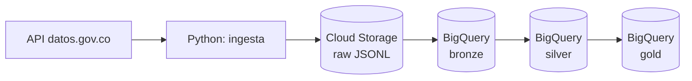
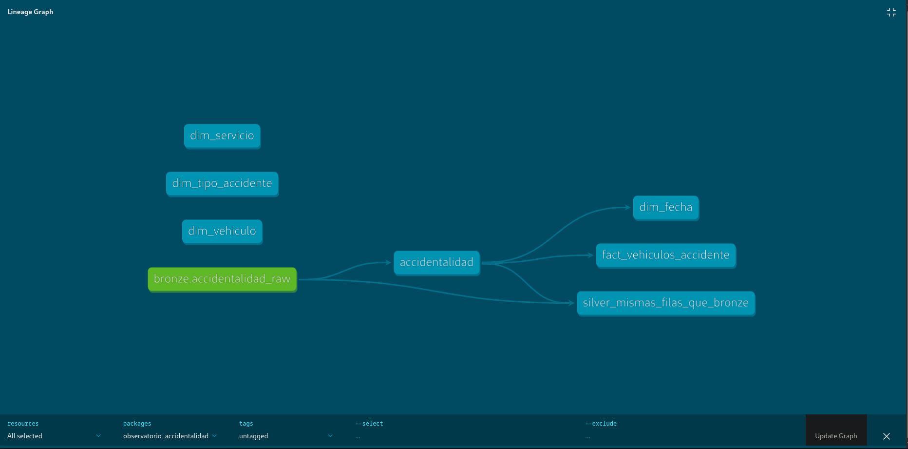

# Barranquilla Road Accidents Pipeline

End-to-end data pipeline for Barranquilla's open road-accident data (2018–present):
API ingestion, raw storage in Google Cloud Storage, and a layered BigQuery warehouse
(bronze → silver → gold) with a star schema.

## Qué responde este proyecto

- ¿Qué tipos de vehículo participan más en los accidentes?
- ¿Cómo varía el total por año, mes y día de la semana?
- ¿Cómo evolucionan los atropellos y la participación de las motocicletas?
- ¿Cómo se reparten los casos por tipo de accidente y servicio del vehículo?

## Arquitectura




Las tres dimensiones sin flechas (`dim_servicio`, `dim_tipo_accidente`, `dim_vehiculo`) son listas de referencia escritas a mano; la tabla de hechos se une a ellas por valor y su integridad la vigilan las pruebas `relationships`.

| Capa | Contenido |
|---|---|
| **Raw (bucket)** | Archivo tal como lo entrega la API, inmutable, en carpetas por fecha de ingesta |
| **Bronze** | Copia en BigQuery del archivo crudo, todo como texto, particionada por día de ingesta |
| **Silver** | Tipos correctos, textos normalizados, nulos explícitos. No descarta filas |
| **Gold** | Modelo en estrella: una tabla de hechos y cuatro dimensiones |

## Fuente de datos

Dataset "Accidentalidad Barranquilla, detalle de vehículos" (datos.gov.co, id `nfa3-wgxy`):
51.483 filas, del 2018-01-01 al 2026-06-16, 6 columnas.

## Modelo de datos (gold)

- `fact_vehiculos_accidente`: una fila por combinación de fecha, dirección, tipo de
  accidente, servicio y clase de vehículo. Métrica: `vehiculos_involucrados`.
- Dimensiones: `dim_fecha`, `dim_vehiculo`, `dim_tipo_accidente`, `dim_servicio`.

## Hallazgos y decisiones

- **`cantidad_accidentes`**: los datos sugieren que cuenta los vehículos de una misma
  clase y servicio en un evento (el 91 % de los choques suma 2 y el 96 % de los
  atropellos suma 1), no accidentes. Sin confirmación oficial, la métrica se llama
  `vehiculos_involucrados`.
- **Duplicados**: 6 combinaciones aparecen dos veces. No se eliminan: probablemente
  son accidentes distintos y el dataset no tiene identificador.
- **Caída desde 2023**: las filas bajan de forma brusca y sostenida (6.653 en 2022,
  2.963 en 2023). No se explica con los datos; puede ser un cambio en el registro.
  Pendiente de investigar.
- **Año 2026 incompleto**: marcado en `dim_fecha.es_anio_completo`.
- Se mantienen las claves naturales en las dimensiones (son pequeñas y estables).
- `MOTOCARRO` y `CUADRICICLO` se clasifican como motocicletas.

## Cómo ejecutarlo

Requisitos: Python 3.11, Google Cloud CLI, un proyecto de Google Cloud con un bucket y
los datasets `bronze`, `silver` y `gold` en `us-central1`.

```bash
python3 -m venv .venv && source .venv/bin/activate
pip install -r requirements.txt
cp .env.example .env          # completa SOCRATA_APP_TOKEN, GCP_PROJECT_ID, GCS_BUCKET
gcloud auth application-default login

python src/ingesta.py             # API -> archivo local
python src/subir_a_bucket.py      # archivo -> Cloud Storage
python src/cargar_a_bigquery.py   # bucket -> BigQuery bronze
```

Luego, desde la carpeta `dbt/`, con el perfil configurado en `~/.dbt/profiles.yml`
(método `oauth`, ubicación `us-central1`):

```bash
dbt run --target prod    # construye silver y gold
dbt test --target prod   # ejecuta las pruebas de calidad
```

## Estructura

```
src/       pipeline de ingesta y carga
dbt/       modelos de silver y gold, pruebas y documentación
scripts/   exploración y pruebas de conexión
docs/      documentación
```

## Estado y próximos pasos

- [x] Ingesta paginada desde la API, con reintentos y verificación de conteo
- [x] Carga a bucket con verificación de integridad
- [x] Carga a BigQuery idempotente
- [x] Silver y gold
- [x] Transformaciones con dbt y pruebas de calidad
- [ ] Orquestación con Airflow y carga incremental
- [ ] Infraestructura como código (Terraform)
- [ ] CI con GitHub Actions
- [ ] Dashboard público

## Limitaciones conocidas

- No hay identificador de accidente: los "accidentes" solo pueden aproximarse.
- Los datos no incluyen gravedad, hora ni coordenadas.
- La normalización de direcciones está pendiente.